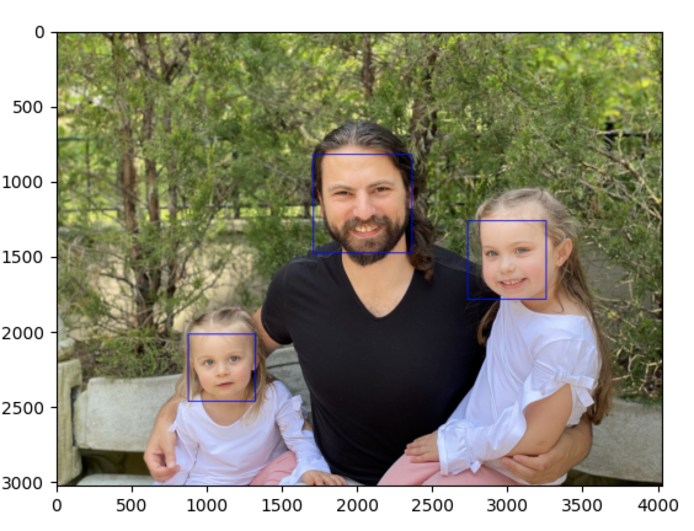
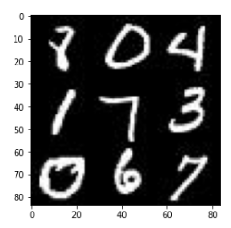
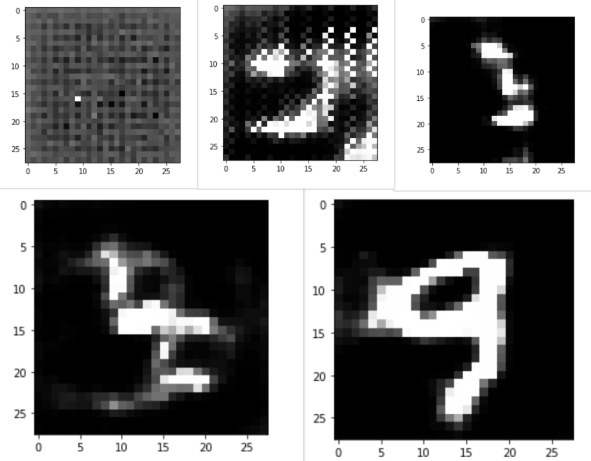

# AI Algorithms

- [Image Detection](#1.-Image-Detection)
- [Text Generation with Recurrent Neural Network](#2.-Text-Generation-with-Recurrent-Neural-Network)
- [Generating Fake People Photos with a Generative Adversarial Network](#3.-Generating-Fake-People-Photos-with-a-Generative-Adversarial-Network)
- [Reinforcement Learning to Solve Interactive Problems](#4.-Reinforcement-Learning-to-Solve-Interactive-Problems)


## 1. Image Detection
----

<br />

### 1.a Facial recognition with Haar Cascades
----

This technique uses Haar cascades, which is a simple yet powerful algorithm that looks for predetermined color contrasts in a photo to detect likely faces. [Here is a tutorial on the technique](https://opencv-python-tutroals.readthedocs.io/en/latest/py_tutorials/py_objdetect/py_face_detection/py_face_detection.html)


<br />

**To run:**

`python ./CNN/haar_cascades_face_detection.py 'path/to/image.png'`

Make sure your argument is a string path to a valid image (png, jpg, jpeg or gif). 

The function will open up your photo with bounding squares around likely faces:


<br />

### 1.b Image Classification with a Convolutional Neural Network
----

We train a CNN on the Cifar10 dataset, which is a bunch of 32x32 images of one of the following categories: 

1. airplane
2. automobile
3. bird
4. cat
5. deer
6. dog
7. frog
8. horse
9. ship
10. truck

Instead of training the entire network, we use a pre-trained base model, the [ResNet50](https://arxiv.org/abs/1512.03385). We then remove the head and add a few trainable layers on top of it. This allows us to leverage the ResNet initial layers, which are strong at detecting base outlines, hierarchies and shapes and only focus training at the end where we classify the specific categories (in this example, the CIFAR10).


<br />

**To run:**

`python ./CNN/cnn.py`

The code will look for a network weights at path `./CNN/weights.hdf5`. If found, will skip training. Otherwise, the code will train on the CIFAR10 dataset (~several hours) and save the weights to the above path. 

It will then pick 10 random photos from the case and print to the console its prediction and level of confidence. 

Finally, it will ask you to input a string path to an image and make a prediction. 

<br />

## 2. Text Generation with Recurrent Neural Network
----

Given a body of text, train a LSTM network to be able to predict the next letter in a sequence. We can do this recursively to auto-generate entirely new text. The fun part is, the model's output is completely flavored by what you put in. Simpson comics? Your favorite book? The bible? Even software source code - the network will write in that style.

[Here is a terrific walk through of how this all works](https://karpathy.github.io/2015/05/21/rnn-effectiveness/).

**To run:**

`python ./RNN/rnn.py`

This will run a demo, trained on 'Portrait of Dorian Gray'. To supply your own, import the code like so:

```
from rnn import TextGenerator

f = open('file', mode='r', encoding='utf-8')
text = f.read()

text_generator = TextGenerator(text)
text_generator.train() # can take a few hours
script = text_generator.generate_text(gen_length=5000)

print(script)
```

Example of generated text:

>" i am not laughing . " 

> "i am quite sure that i was afraid. when i grew afraid and put his head, with a piteous expression of paradise 
> and put up the scarlet dew that book the office of frescoes in the things that had been brought by 
> vivisecting himself. human life--that ! the bible, and the secret of life is the key in the theatre...

well... 

<br />

## 3. Generating Fake Handwritten Numbers with a Generative Adversarial Network
----

GAN's are behind some of the fields most exciting yet (sometimes) creepy achievements. Namely, GAN's have been used to successfully create (deep) fakes, whether of images, video, sound and more. The way they work is pretty cool.

In our example, we're going to look at generating life-like handwritten numbers. We have a dataset with 60,000 images of handwritten digits, that look somthing like this:



Instead of one network, we create two neural networks with opposing goals. 

1. The "Generator" network will try to create brand new "fakes". In our example, the Generator will try to create an image that looks like a handwritten digit.

2. The "Discriminator" network tries to decide whether an image is ral or fake. 

We feed to stream into the discriminator - data with real handwritten numbers and images from the generator network. The discriminator is successful if it properly labels images from the real feed as real and images from the generator as fake.

The generator has the exact opposite goal. It will generate new images and it is considered successful when one of its images is marked as "real" by the discriminator.

The two networks battle it out until both are really, really good at what they do. By that time, we'll have one network that is very good at looking out for counterfeits, and another (perhaps equally as) good at creating them.

After a few rounds of training:




<br />

## 4. Reinforcement Learning to Solve Interactive Problems
----

- Dynamic Programming
- DQN
- VPG
- DDPG
- PPO